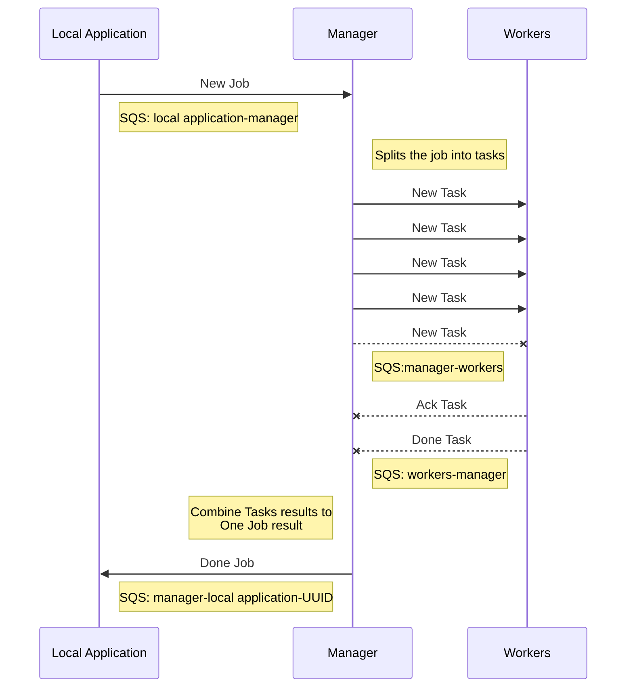
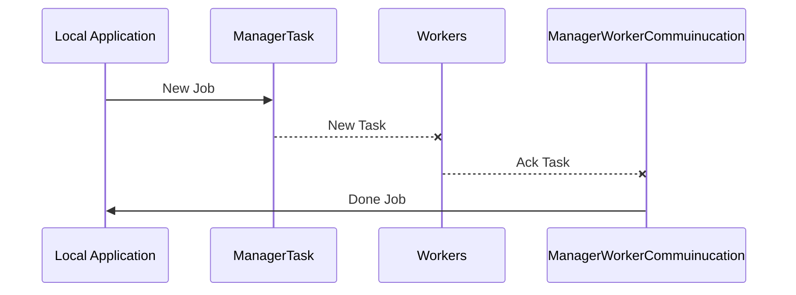

# AWS-Text Analysis
A tool for parsing text files created by [**Dror**](https://github.com/drorgabay) and [**Tom**](https://github.com/ToMax446).
This tool was created using [**Stanford's Parser**](https://stanfordnlp.github.io/CoreNLP/parser-standalone.html), and allows for multiple parsing options on many text files.
The tool is running on AWS using EC2, S3 and SQS to manage and distribute the parsing in the [**"Map Reduce"**](https://en.wikipedia.org/wiki/MapReduce) model.

## Requirements
 - Java SE 8+
 - AWS account
 - Instance Type: T2_MICRO

## Activation

You need to set up your AWS credentials, as shown in [**this guide**](https://docs.aws.amazon.com/cli/latest/userguide/cli-configure-files.html). 
Once you did that, simply run the command `java -jar localapplication.jar inputFileName outputFileName n [terminate]` in command prompt.

## Notes on the project

### Scalability
#### Local application Connection
In our tool, the Manager uses an Executor service (currently set for 15 threads but can easily change) for connection with Local Applications so it can support large number of connections without blocking.
The connection with the workers, and a worker checker (more on that later) run on a dedicated threads of their own.
#### S3 storage
AWS's S3 is limited to 100 buckets in a single run. So we used one bucket for each type of file, and the division between each local application is done by using UUID as a local application's identifier. This identifier is later used to create a folder in S3 for all single parsing (a task) of the job, and then the Manager can combine it all to a single result file.
#### Heavy text parsing
Parsing multiple text files can be heavy, but our tool will launch EC2 instances on demand, and will distribute the Job into tasks between them. Since this is a course assignment, we did not delegate and micro-managed the distribution, but rather split the Job to file, having each file as a Task.
### All-In-One
All of the files, including Manager and Worker's jar files, Parsing model, etc are residing on S3 in a dedicated buckets. Once you put your credentials correctly, you do not need any special image (AMI) to run our tool.
### Parsing the files
As far as parsing each file, our Worker gets the parsing type required through the SQS message, and then uses the stanford's parser to retrieve the correct parsing of the file. The file is then uploaded to the folder of the local application and waiting for the manager to combine the results of all Tasks once the job is finished.
### Liveliness
Workers are simple computers and can fall either by termination by mistake or shutdown, connection loss etc.
In order to ensure that our tool keeps going on even if a Worker is failing, we have our Worker Connection thread. This thread checks the status of every worker in the list. If a Worker isn't "Running" by the EC2 client, we reassign it's task as new messages to the active workers.
### Flow
The tool starts by getting input file name, output file name, number of workers per task and whether the tool should terminate. If the local application can't find a Manager, it launches one.
The local application sends a message through the SQS to the manager stating it's UUID and the input file location.
The Manager then decides how many Workers should be activate due to it's restrictions and launches them.
Then the Manager splits the job to tasks and sends each task over SQS to a dedicated queue with the workers.
The Workers then poll for tasks and then call the parser for parsing the file. The Workers then upload the file to the folder of the specific local application in order for the Manager to combine.
At last, the Manager uploads a unified file of result to S3, and sends an SQS message to the local application on a dedicated queue only for this local application, stating that the job is done.
The local application will download the result and make an HTML file out of it.

----

## UML diagram of the project

Macro:

Micro:

Those UMLS created with  [Mermaid](https://mermaidjs.github.io/).

